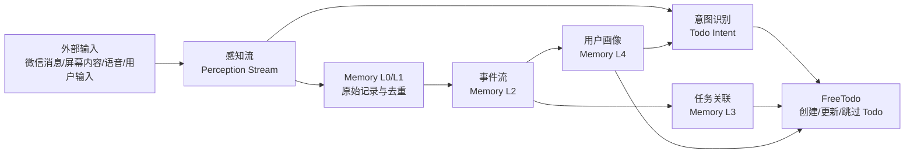
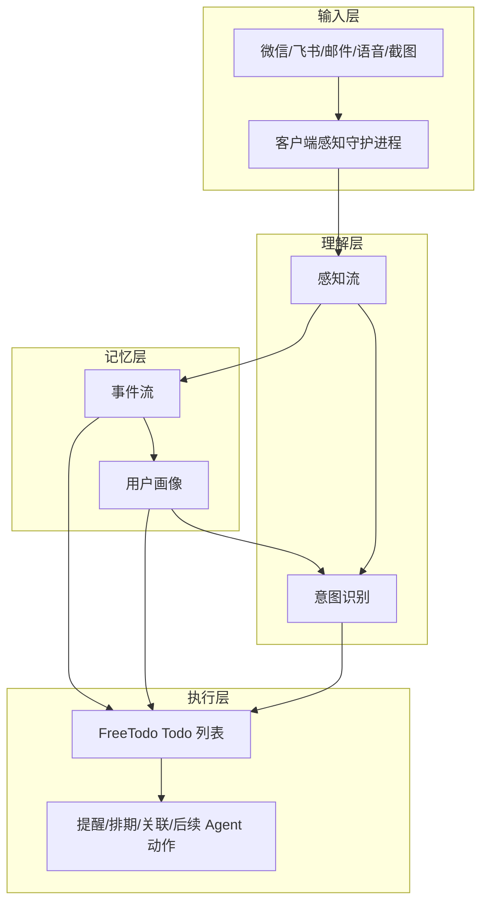
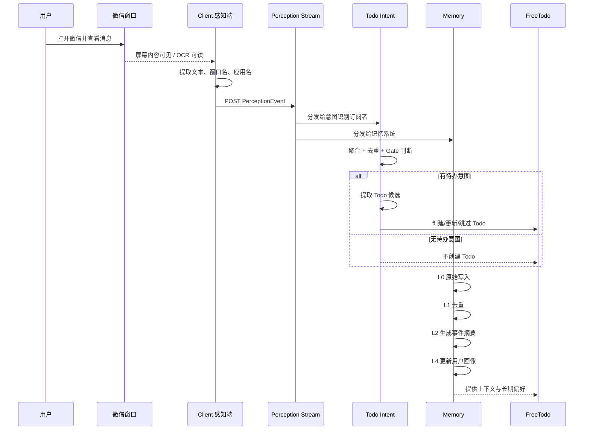
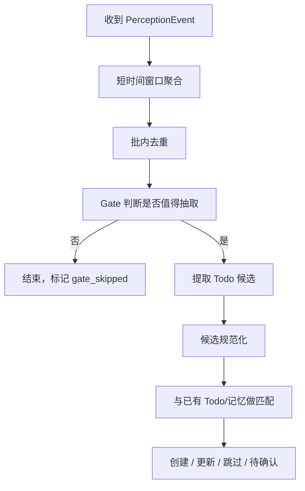
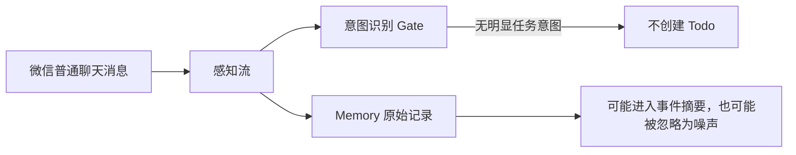
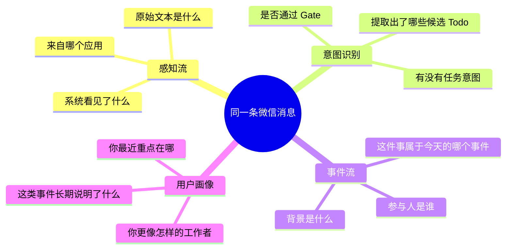

# 四大核心面板与 FreeTodo 数据流说明

## 1. 这份文档讲什么

这份文档专门解释 FreeTodo 里 4 个关键面板背后的技术原理，以及它们和 FreeTodo 本体的关系：

- 感知流
- 意图识别
- 事件流
- 用户画像

如果把 FreeTodo 看成一个会逐渐理解用户、并主动帮用户整理任务的系统，那么这 4 个面板其实对应 4 个不同抽象层级：

1. **感知流**：系统刚刚感知到了什么
2. **意图识别**：这些感知里有没有“要办的事”
3. **事件流**：今天到底发生了哪些成型事件
4. **用户画像**：长期来看，你是怎样的人、最近在忙什么

而 **FreeTodo 的 Todo 系统本体**，就建立在这 4 层之上。

---

## 2. 一张总览图

可以把它简单理解为：

- **感知流**负责收集原始信号
- **意图识别**负责把信号变成任务候选
- **事件流**负责把一天的碎片整理成事件
- **用户画像**负责把长期事件沉淀成对你的理解
- **FreeTodo** 负责最终承接这些结果，变成真正可执行的 Todo

---

## 3. 四个面板分别是什么

### 3.1 感知流

感知流是整套系统最底层的实时数据总线。

它接收来自不同来源的感知事件，例如：

- 屏幕 OCR 文本
- 主动 OCR 检测到的文本
- 麦克风转写文本
- 用户主动输入的内容
- AI 输出内容

这些数据会被统一包装成 `PerceptionEvent`，核心字段包括：

- `event_id`：事件唯一 ID
- `timestamp`：事件时间
- `source`：来源，例如 `ocr_screen`、`ocr_proactive`、`mic_pc`
- `modality`：模态，例如 `text`、`image`、`audio`
- `content_text`：主要文本内容
- `metadata`：应用名、窗口名、说话人等上下文信息

对应代码：

- `server/perception/models.py`
- `server/perception/stream.py`
- `server/routers/perception_ingest.py`
- `client/sensor.py`

#### 感知流的作用

感知流并不直接“理解”任务，它做的是：

- 先把所有外部信号统一起来
- 变成可被后续模块消费的标准事件流
- 提供实时流式展示能力
- 提供最近窗口回放能力

所以在 UI 上，**感知流面板展示的是“系统刚刚看到了什么”**，而不是“系统已经做出了什么决策”。

---

### 3.2 意图识别

意图识别是感知流上的一个智能处理层。

它的目标不是记录事实，而是回答一个问题：

> 这段刚刚感知到的内容里，有没有值得进入 FreeTodo 的待办意图？

它的典型处理流程是：

1. 收到感知事件
2. 在一个短时间窗口内聚合多条相关事件
3. 做去重和文本裁剪
4. 用 Gate 判断是否值得继续抽取
5. 如果值得，再提取 Todo 候选项
6. 对候选项做规范化、去重、和已有 Todo 对比
7. 最后决定是创建、更新、跳过，还是待人工确认

对应代码：

- `server/perception/subscribers/todo_intent_subscriber.py`
- `server/services/perception_todo_intent/orchestrator.py`
- `server/services/perception_todo_intent/gate.py`
- `server/services/perception_todo_intent/extractor.py`
- `server/services/perception_todo_intent/integration.py`

#### 意图识别的关键思想

它不是“看见一句话就立刻创建 Todo”，而是分两层判断：

- **Gate**：先判断这段内容有没有任务价值
- **Extractor**：再把它提取成结构化候选任务

这样做的好处是：

- 可以过滤掉大量闲聊、噪声和无效信息
- 可以减少误建 Todo
- 可以把“普通消息”和“可执行消息”区分开

所以在 UI 上，**意图识别面板展示的是“系统如何从感知流走到任务”的决策过程**。

---

### 3.3 事件流

事件流不是原始感知流的简单复制，而是更高一层的“事件摘要层”。

系统会把一天中积累下来的原始记录和去重记录进行压缩，总结成“今天发生了哪些有意义的事件”。

比如原始感知可能是几十条碎片：

- 微信里看了几条消息
- 回复了一句合同相关内容
- 切到浏览器查了一份文档
- 又回到微信继续沟通

这些在事件流中可能会被压缩成一个更完整的事件：

> 上午与同事在微信沟通合同初稿，并同步查阅相关资料

对应代码：

- `server/memory/writer.py`（L0 原始写入）
- `server/memory/compressor.py`（L2 事件压缩）
- `frontend/apps/event-stream/EventStreamPanel.tsx`

#### 事件流的作用

事件流更像“叙事层”，它回答的是：

> 今天到底发生了哪些完整的事情？

这层对 FreeTodo 很重要，因为任务不能只依赖一句孤立文本，还需要知道它所处的上下文、参与人和背景。

---

### 3.4 用户画像

用户画像是最上层的长期记忆层。

它会定期读取最近的事件摘要，然后增量更新成一份稳定的用户理解文档，例如：

- 你的身份与角色
- 工作模式
- 当前重点
- 社交网络
- 偏好与习惯
- 近期状态

对应代码：

- `server/memory/profile_builder.py`
- `server/routers/memory.py`
- `frontend/apps/user-profile/UserProfilePanel.tsx`

#### 用户画像的作用

用户画像不是为了回放单次事件，而是为了让系统逐渐回答这些问题：

- 你现在长期在推进什么方向
- 你偏好怎样的工作方式
- 你常跟谁协作
- 你目前压力大不大、重心在哪

这层会反过来影响意图识别和 Todo 决策，让 FreeTodo 不是机械记任务，而是越来越懂你。

---

## 4. 它们和 FreeTodo 的关系

可以把 FreeTodo 理解为执行核心，而这四个面板是它的“感官、理解、记忆”。

具体关系如下：

- **感知流 -> FreeTodo**：提供原始输入来源，降低手动录入成本
- **意图识别 -> FreeTodo**：把感知内容转成 Todo 候选或直接任务
- **事件流 -> FreeTodo**：为任务补充上下文和阶段性叙事
- **用户画像 -> FreeTodo**：为任务决策提供长期偏好和当前重点

换句话说：

> FreeTodo 不是孤立的待办列表，而是建立在“感知 -> 理解 -> 记忆 -> 执行”链路上的任务系统。

---

## 5. 结合微信消息的完整例子

我们用一个具体场景来说明。

### 场景

你点开微信，看到一条新消息：

> 明天下午三点前把合同初稿发我。

系统会如何处理？

---

## 6. 微信消息处理全链路图

---

## 7. 这条微信消息在系统里到底经历了什么

### 第一步：客户端采集

本地的感知守护进程会做这些事情：

1. 获取当前前台窗口
2. 判断当前应用是否是微信
3. 对屏幕做截图或 ROI 提取
4. 对图像做 OCR
5. 把识别结果连同上下文封装成一个 `PerceptionEvent`
6. 发送到后端 `/api/perception/ingest`

这一步产出的还只是“事实信号”，例如：

- 应用名：微信
- 窗口名：某个聊天窗口
- 文本内容：明天下午三点前把合同初稿发我
- 来源：`ocr_screen` 或 `ocr_proactive`
- 模态：`text`

---

### 第二步：进入感知流

后端收到后，会把它放入感知流总线中。

这一步系统做的事情主要是：

- 给事件分配 `sequence_id`
- 记录 `ingested_at`
- 把事件放入滑动窗口缓冲区
- 分发给所有订阅者

此时在 **感知流面板** 里，你能看到的是：

- 一条来自微信的实时事件
- 它的来源、模态、文本预览、时间等信息

这里系统只是“看见了消息”，还没有下结论。

---

### 第三步：意图识别判断是否是 Todo

意图识别订阅者收到事件后，不会立刻建 Todo，而是会先做一小段时间窗口内的聚合。

原因是：

- 一条任务往往不是单条消息就能完整表达
- 可能前后还有补充信息
- 同一段时间内可能有 OCR 和音频两种来源

然后系统会进入以下流程：

对于这条消息：

> 明天下午三点前把合同初稿发我

Gate 通常会判断：

- 这是一个明确的可执行任务
- 含有动作目标：发合同初稿
- 含有时间约束：明天下午三点前

于是提取器会把它转成结构化候选，例如：

- 标题：发合同初稿
- 截止时间：明天下午 15:00 前
- 来源原文：这条微信消息
- 标签：合同 / 协作 / 微信

然后集成层会继续判断：

- 这是不是一个新 Todo
- 还是已有“合同初稿”任务的补充更新
- 会不会与当前某个任务冲突
- 是否需要直接创建，还是先进入草稿/待确认

最终，这条消息才真正进入 FreeTodo。

此时在 **意图识别面板** 里，你能看到的是：

- 收到事件
- Gate 是否通过
- 提取出了哪些候选任务
- 集成结果是创建、更新还是跳过

---

### 第四步：进入事件流

与此同时，这条消息也会进入 Memory。

首先是 L0 原始写入，也就是按天记入原始感知日志；接着经过去重和压缩，进入 L2 事件摘要。

这一步的重点不是“是否建 Todo”，而是“今天到底发生了什么”。

比如这条消息，可能会和前后的行为一起被整理成一个事件：

> 上午在微信与同事沟通合同初稿，确认需要在明天下午三点前发送。

这就是 **事件流面板** 里展示的内容。

所以事件流和意图识别看的是同一段现实，但关注点不同：

- 意图识别看“要不要办事”
- 事件流看“发生了什么事”

---

### 第五步：更新用户画像

当类似事件不断积累以后，用户画像模块会周期性读取这些事件摘要，推断一些更长期的信息，例如：

- 你近期在推进商务合同相关工作
- 你频繁通过微信处理协作事务
- 你当前阶段的重点是合同和交付推进
- 你和某些联系人存在高频协作关系

这类结果不会直接变成单个 Todo，但它会反过来影响未来的判断：

- 哪类消息更像你的高优先级任务
- 某个任务是不是你当前重点的一部分
- 任务命名、优先级、关联推荐该如何做

这就是 **用户画像面板** 的意义：

> 它不是记录单次消息，而是在累积“系统对你的理解”。

---

## 8. 如果消息只是普通闲聊，会发生什么

再看另一个例子：

> 哈哈，晚上聊。

这条消息同样会进入感知流，但后续路径会不同。

也就是说：

- **感知流里能看到**
- **意图识别里大概率不会产生 Todo**
- **事件流里未必保留**，因为它可能被压缩阶段判断为低信息量噪声
- **用户画像里通常也不会留下明显痕迹**

这也是为什么系统要分层：不是每一条消息都值得变成任务。

---

## 9. 四个面板看的是同一个现实的四个切面

所以你会发现：

- 它们不是 4 套彼此独立的系统
- 而是同一条数据在不同抽象层的投影

---

## 10. 一句话理解这四个面板

- **感知流**：系统刚刚看到了什么
- **意图识别**：系统觉得你要做什么
- **事件流**：系统总结你刚刚发生了什么
- **用户画像**：系统逐渐理解你是怎样的人

而 **FreeTodo** 的价值就在于：

> 它把这些“看到、理解、总结、记住”的能力，最终落到“帮你把事情办起来”上。

---

## 11. 对应代码索引

如果后续你想继续顺着代码读，可以从下面这些文件入手：

### 输入与感知

- `client/sensor.py`
- `server/perception/models.py`
- `server/perception/stream.py`
- `server/routers/perception_ingest.py`

### 意图识别

- `server/perception/subscribers/todo_intent_subscriber.py`
- `server/services/perception_todo_intent/orchestrator.py`
- `server/services/perception_todo_intent/gate.py`
- `server/services/perception_todo_intent/extractor.py`
- `server/services/perception_todo_intent/integration.py`

### 记忆与事件流

- `server/memory/manager.py`
- `server/memory/writer.py`
- `server/memory/compressor.py`
- `server/memory/task_linker.py`
- `server/memory/reader.py`

### 用户画像

- `server/memory/profile_builder.py`
- `server/routers/memory.py`
- `frontend/apps/user-profile/UserProfilePanel.tsx`

---

## 12. 最后的结论

如果只看产品表面，FreeTodo 像是一个 AI Todo 工具。

但从底层架构看，它其实在搭一条完整链路：

1. 从生活里自动采集信号
2. 从信号里识别任务意图
3. 从碎片里生成事件上下文
4. 从长期事件里构建用户画像
5. 再把这些能力反馈到 Todo 管理和后续主动服务中

所以这 4 个面板不是“附属展示面板”，而是 FreeTodo 未来能力的核心骨架。
